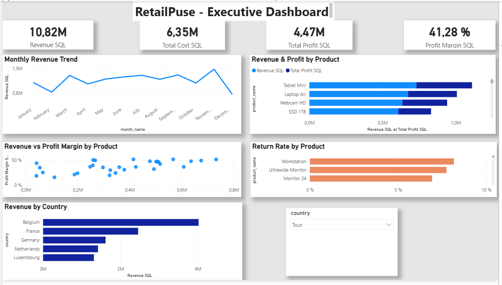

\# RetailPulse — End-to-End Business Intelligence Project


RetailPulse is an end-to-end Business Intelligence project designed to transform raw retail data into actionable business insights.


The project covers the complete BI workflow:


\*\*Raw Data → Staging → Data Cleaning → Data Warehouse → SQL Analysis → Power BI → Business Insights\*\*


\## Business Objective


RetailPulse management needs a consolidated view of sales performance, profitability, customers, products, markets and product returns.


The objective is to answer questions such as:


\- Which products generate the most revenue?

\- Which products generate strong sales but weak margins?

\- Which customers contribute the most revenue?

\- Which countries and sales channels perform best?

\- How do revenue, profit and margin evolve over time?

\- Which products have the highest return rates?


\## Technology Stack


\- SQL Server

\- SQL Server Management Studio (SSMS)

\- Power BI

\- Power Query

\- DAX

\- SQL

\- CSV data sources

\- Git / GitHub


\## Data Pipeline


The project follows a layered BI architecture:


```text

CSV Data Sources

&#x20;      ↓

SQL Staging Layer

&#x20;      ↓

Data Cleaning \& Transformation

&#x20;      ↓

Dimensional Data Warehouse

&#x20;      ↓

SQL Business Analysis

&#x20;      ↓

Power BI Data Model

&#x20;      ↓

Executive Dashboard

```


The staging layer preserves raw source data before transformation.


SQL transformations handle data quality issues including:


\- Duplicate records

\- Missing values

\- Inconsistent country names

\- Mixed date formats

\- Inconsistent text formatting

\- Invalid sales records


\## Data Warehouse


The analytical model is based on a star-style dimensional architecture.


```text

DimCustomer ──┐

&#x20;             │

DimProduct ───┼── FactSales ─── FactReturns

&#x20;             │

DimDate ──────┘

```


Main tables:


\- `DimCustomer\_New`

\- `DimProduct\_New`

\- `DimDate\_New`

\- `FactSales\_New`

\- `FactReturns\_New`


The cleaned sales fact table contains \*\*4,993 valid sales transactions\*\*.


\## Key Metrics


The SQL analytical layer calculates several business KPIs, including:


\- Revenue

\- Total Cost

\- Total Profit

\- Profit Margin %

\- Units Sold

\- Returned Units

\- Return Rate %


Current global results from the cleaned SQL dataset:


| KPI | Value |

|---|---:|

| Revenue | 10.82M |

| Total Cost | 6.35M |

| Total Profit | 4.47M |

| Profit Margin | 41.28% |


\## SQL Business Analysis


The project includes SQL analyses covering:


\- Overall business KPIs

\- Product performance

\- Customer performance

\- Country performance

\- Sales channel performance

\- Product return rates

\- Monthly performance

\- High-revenue / low-margin product detection


Advanced SQL concepts used include:


\- `JOIN`

\- `GROUP BY`

\- CTEs

\- `CASE`

\- `ROW\_NUMBER()`

\- Window functions

\- `TRY\_CONVERT`

\- Conditional data cleaning

\- Aggregate calculations


\## Power BI Dashboard



An interactive executive dashboard was created in Power BI.


It includes:


\- Revenue

\- Total Cost

\- Total Profit

\- Profit Margin

\- Monthly Revenue Trend

\- Revenue \& Profit by Product

\- Revenue vs Profit Margin analysis

\- Return Rate by Product

\- Revenue by Country

\- Interactive country filtering


DAX measures were created for revenue, cost, profit, margin, units sold and return rate.


\## Repository Structure


```text

RetailPulse-BI/

│

├── README.md

├── data/

│   └── raw/

│

├── sql/

│   ├── 01\_staging.sql

│   ├── 02\_dimensions.sql

│   ├── 03\_facts.sql

│   └── 04\_business\_analysis.sql

│

├── powerbi/

│   └── RetailPulse.pbix

│

├── screenshots/

│

└── docs/

```


\## What This Project Demonstrates


This project demonstrates practical experience with:


\*\*Data ingestion → ETL → SQL Server → dimensional modelling → data quality → SQL analytics → Power BI → DAX → business reporting.\*\*


The focus is not only on building visualizations, but on creating a structured BI pipeline that converts raw operational data into information that can support business decisions.

